# 🍽️ Teranga Table — Application de réservation full-stack

> Application web full-stack pour la gestion de réservations d'un restaurant sénégalais, développée avec Next.js, TypeScript, PostgreSQL et une API sécurisée.

**Frontend → API → validation serveur → PostgreSQL → espace admin → notifications email**

🔗 **Démo en ligne :** https://restaurant-template-five-pi.vercel.app/

## 🖼️ Aperçu

### Site public

| Accueil | Nos signatures |
| :---: | :---: |
|  | 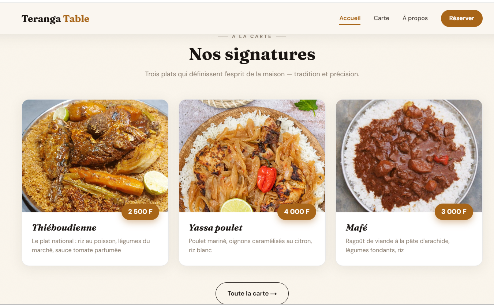 |

| Menu — Dîner | Menu — Jus & boissons |
| :---: | :---: |
| 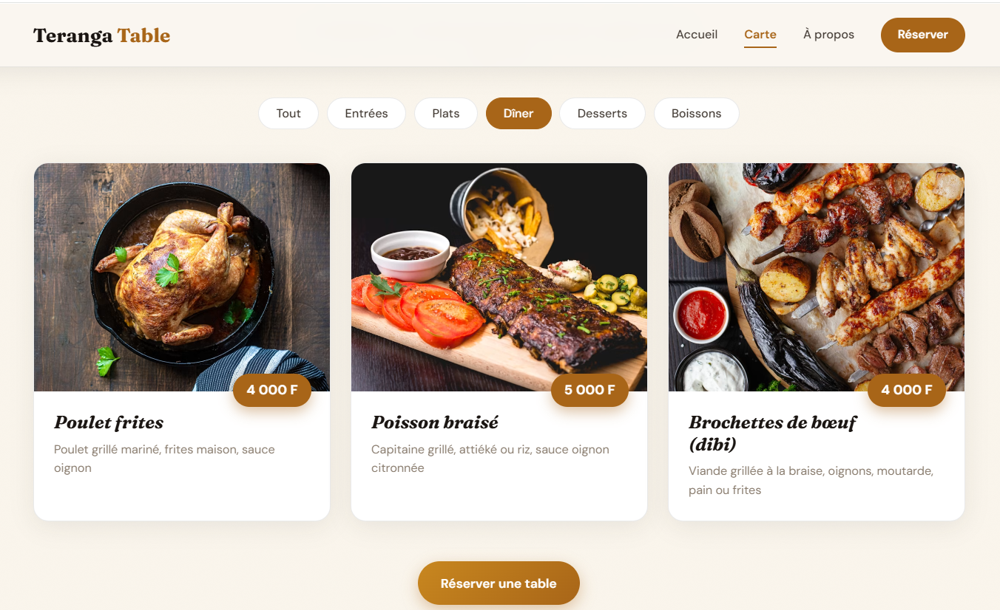 | 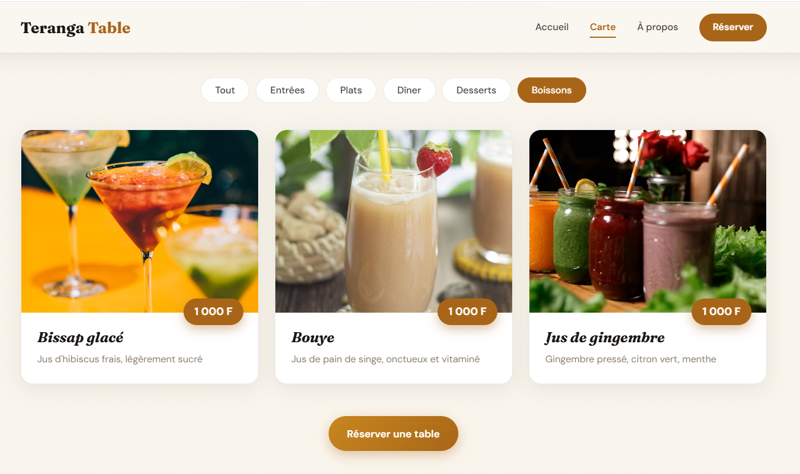 |

| Notre histoire | Appel à réserver & pied de page |
| :---: | :---: |
| 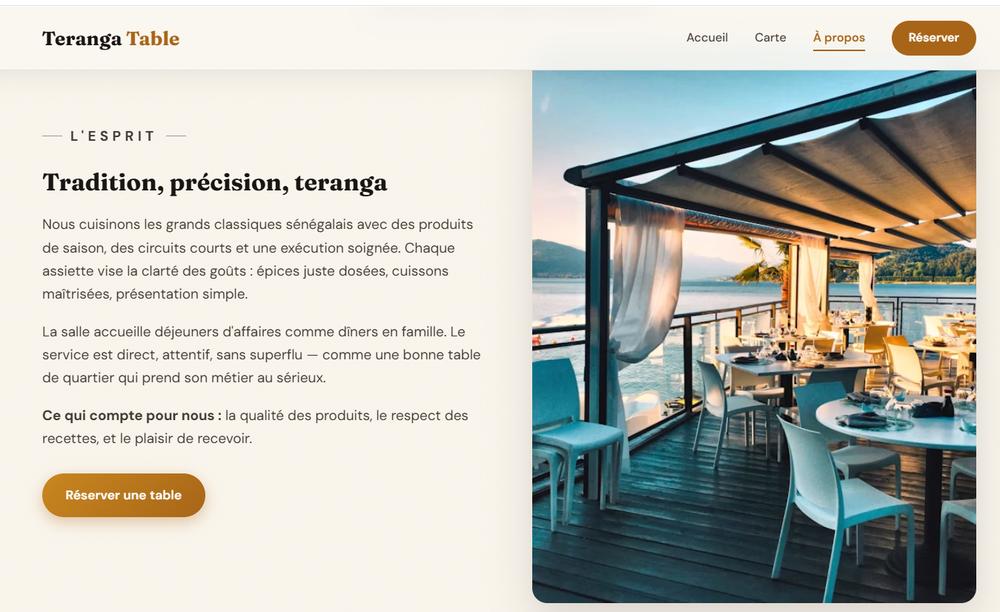 |  |

### Réservation & localisation

| Formulaire de réservation | Carte de localisation |
| :---: | :---: |
| 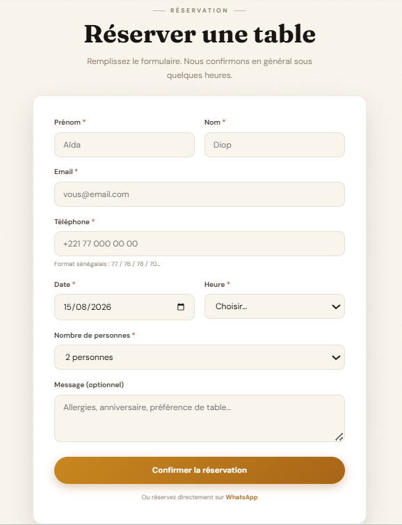 |  |

La carte de localisation (Leaflet / OpenStreetMap, marqueur doré pulsé) pointe
vers l'adresse configurée dans `content/site.ts`.

### Espace admin

| Connexion | Tableau des réservations |
| :---: | :---: |
| 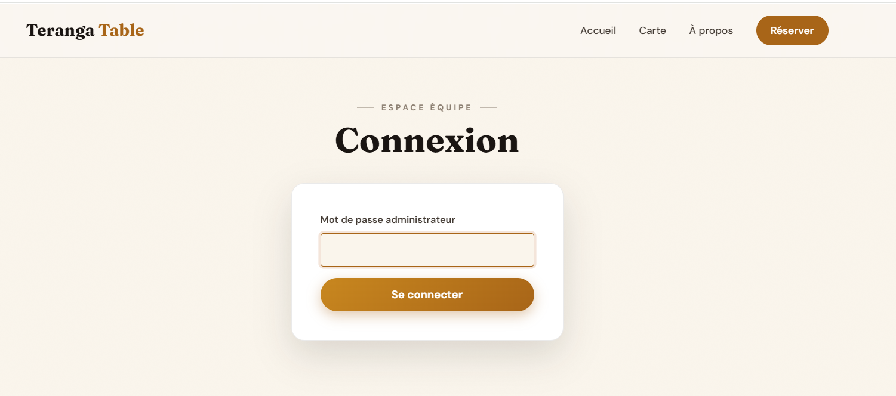 | 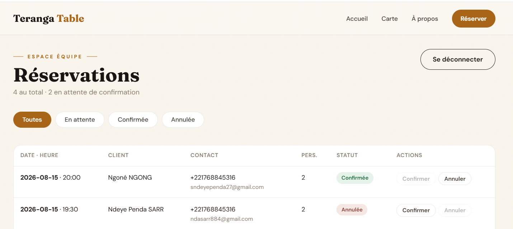 |

### 📧 Notifications par email (Brevo)

Le client reçoit un email automatique à chaque étape de sa réservation, avec
un template aux couleurs du restaurant (date, heure, nombre de personnes).

| Reçu dans la boîte de réception | Accusé de réception (à la soumission) |
| :---: | :---: |
| 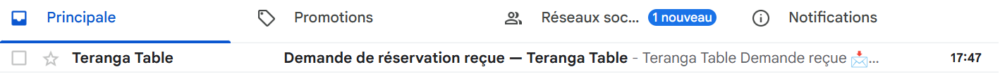 | 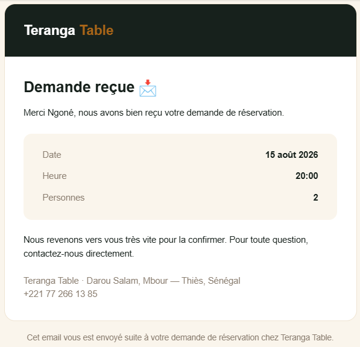 |

| Confirmation (par l'admin) | Annulation (par l'admin) |
| :---: | :---: |
| 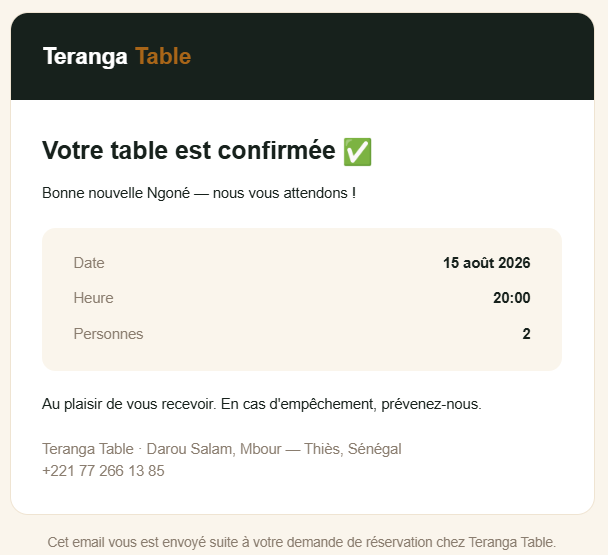 | 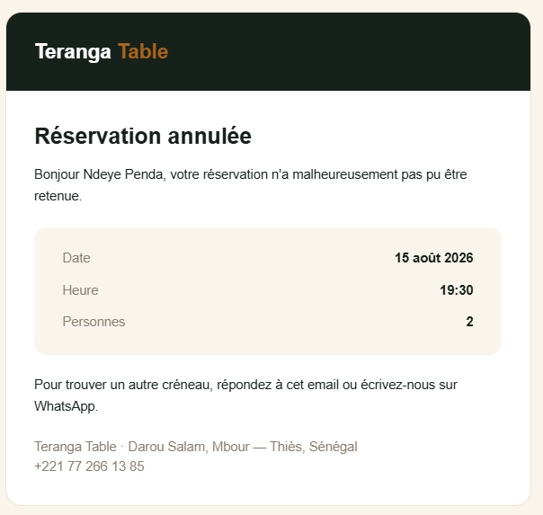 |

## ✨ Fonctionnalités

- **Site public** : accueil éditorial, carte filtrable par catégorie, page à
  propos, page réservation, carte de localisation Leaflet.
- **Réservation full-stack** : formulaire → `POST /api/reservations` avec
  **validation serveur (zod)** → enregistrement en base **PostgreSQL** (Drizzle).
- **Espace admin** (`/admin`, protégé) : liste des réservations, filtres par
  statut, confirmation / annulation en un clic (`PATCH /api/reservations/:id`).
- **Notifications email transactionnelles (Brevo)** : le client reçoit
  automatiquement un email à la soumission de sa demande (accusé de
  réception), puis un second lorsque l'admin confirme ou annule. Envoi non
  bloquant — un échec d'envoi ne fait jamais échouer l'action côté serveur ou
  admin, il est simplement loggé.
- **Authentification** : connexion par mot de passe → **cookie de session signé
  (JWT via jose)**, `middleware` qui protège `/admin`, comparaison du mot de
  passe à temps constant.
- **Animations** : reveal au scroll en cascade, entrée du hero, cartes animées
  au changement de filtre, micro-interactions — le tout désactivé si
  `prefers-reduced-motion`.

## 🧱 Stack & architecture

| Couche             | Choix                                                        |
| ------------------ | ------------------------------------------------------------ |
| Framework           | Next.js 16 (App Router, Route Handlers, middleware)          |
| Langage             | TypeScript strict                                             |
| Style               | Tailwind v4 + design system maison (`app/globals.css`)       |
| Base                | PostgreSQL via **Drizzle ORM** + driver serverless **Neon**  |
| Validation          | **zod** (partagée client + serveur)                          |
| Auth                | **jose** (JWT signé en cookie httpOnly)                      |
| Email transactionnel| **Brevo** (API REST, sans dépendance npm)                    |
| Carte               | **Leaflet** + OpenStreetMap (sans clé API)                   |
| Tests               | Vitest                                                        |

```
app/            pages publiques, /admin, et /api (Route Handlers)
components/      Header, Footer, MenuGrid, ReservationForm, AdminTable, RestaurantMap…
content/         site.ts + menu.ts (contenu typé, séparé du code)
db/              schema Drizzle + client (init paresseuse)
lib/             validation (zod) + auth (jose) + email (notifications Brevo)
drizzle/         migrations SQL générées
```

## 🚀 Démarrer en local

### 1. Installer

```bash
npm install
```

### 2. Base de données (Neon — gratuit)

1. Crée un projet sur [neon.tech](https://neon.tech) (offre gratuite).
2. Copie l'URL de connexion **pooled**.
3. Copie `.env.example` en `.env` et renseigne les variables :

```bash
cp .env.example .env
```

```dotenv
DATABASE_URL="postgresql://…@…neon.tech/…?sslmode=require"
ADMIN_PASSWORD="ton-mot-de-passe-admin"
AUTH_SECRET="une-longue-chaine-aleatoire"   # openssl rand -base64 32
```

### 3. Emails transactionnels (Brevo — gratuit, 300 emails/jour)

1. Crée un compte sur [brevo.com](https://brevo.com).
2. Vérifie une adresse expéditeur : menu du compte → **Paramètres** →
   **Senders, Domains & IPs** → onglet **Senders** → ajoute et vérifie ton
   adresse (un clic dans l'email de confirmation reçu).
3. Crée une clé API : **Paramètres** → **SMTP & API** → onglet **Clés API &
   MCP** → **Générer une nouvelle clé API**.
4. Ajoute ces variables à ton `.env` :

```dotenv
BREVO_API_KEY="xkeysib-ta-cle"
EMAIL_FROM="l-adresse-verifiee@exemple.com"
EMAIL_FROM_NAME="Teranga Table"
```

> Sans ces variables, le site fonctionne normalement — l'envoi d'email est
> simplement sauté (log d'avertissement en console).

### 4. Créer les tables

```bash
npm run db:migrate     # applique les migrations à ta base Neon
```

### 5. Lancer

```bash
npm run dev            # http://localhost:3000
```

L'espace admin est sur **`/admin`** (mot de passe = `ADMIN_PASSWORD`).

## 🧪 Commandes

```bash
npm test           # tests unitaires (Vitest)
npm run lint       # ESLint
npx tsc --noEmit   # types
npm run build      # build de production
npm run db:generate  # régénère une migration après modif du schéma
npm run db:migrate   # applique les migrations
```

## ✅ Qualité & tests

- **TypeScript strict**, **ESLint** et build : zéro erreur.
- **Tests Vitest** : validation des réservations (téléphone SN, date passée,
  créneaux, bornes) et intégrité de la carte (champs, clés uniques, images
  locales présentes).
- **CI GitHub Actions** : lint + types + tests + build à chaque push et PR.
- **Accessibilité** : skip-link, focus visible, navigation clavier, ARIA,
  `prefers-reduced-motion`.

## 🌍 Déployer sur Vercel

1. Importe le dépôt sur [vercel.com](https://vercel.com).
2. Ajoute les **variables d'environnement** (`DATABASE_URL`, `ADMIN_PASSWORD`,
   `AUTH_SECRET`, `BREVO_API_KEY`, `EMAIL_FROM`, `EMAIL_FROM_NAME`) dans les
   réglages du projet, pour les 3 environnements (Production, Preview,
   Development).
3. Applique les migrations sur ta base Neon (`npm run db:migrate` en local
   pointant sur la même base).
4. Déploie, puis reporte l'URL en haut de ce README.

---

Conçu et développé par **Ndeye Penda Sarr** - 2026.