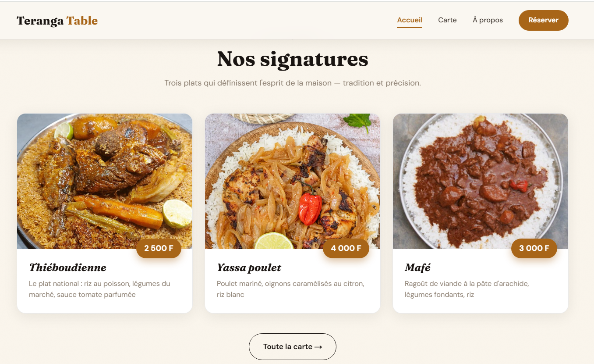
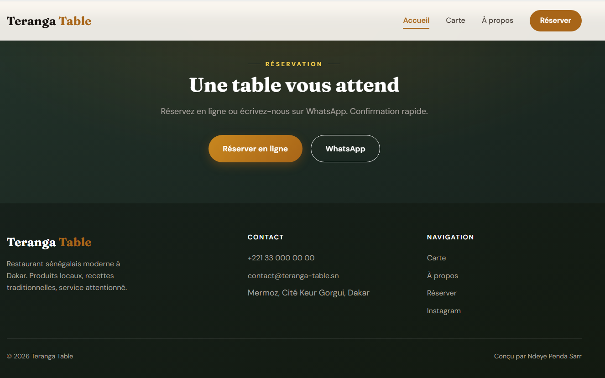
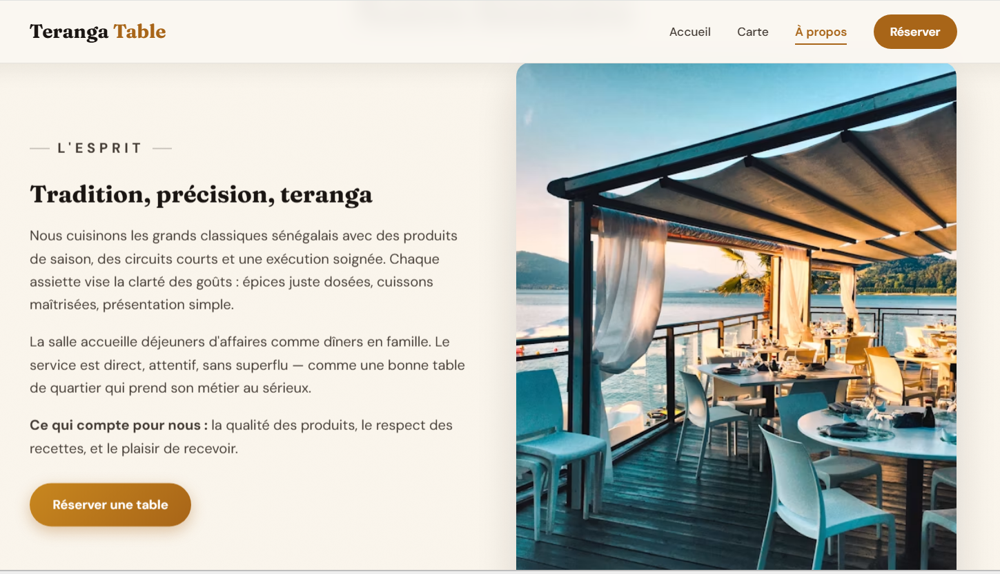
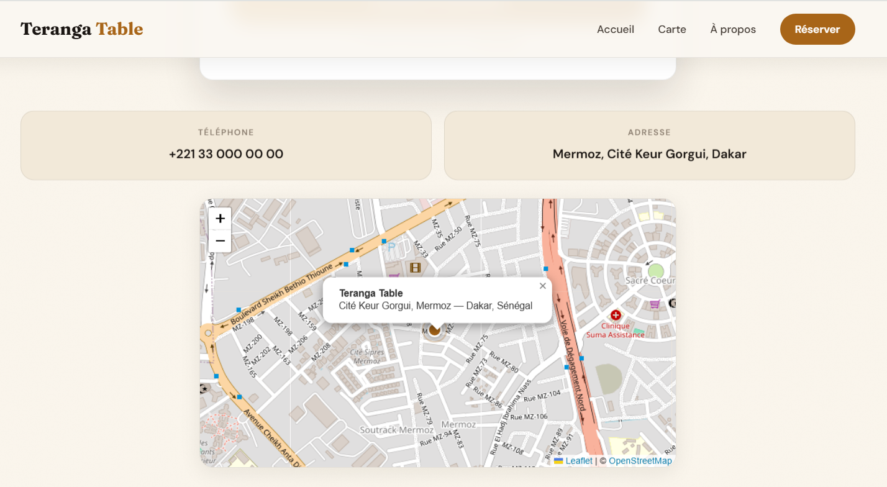

# 🍽️ Teranga Table — restaurant sénégalais (full-stack)

Site vitrine **et** système de réservation complet pour un restaurant, construit
avec **Next.js 16, TypeScript, Tailwind v4, Drizzle ORM et PostgreSQL**.

Réservation en ligne → **API** → **base de données** → **espace admin protégé**
pour confirmer ou annuler les demandes.

> **🔗 Démo en ligne :** _à compléter_ — reporte ici ton URL Vercel.

## 🖼️ Aperçu

| Accueil | Nos signatures |
| :---: | :---: |
|  |  |

| Appel à réserver & pied de page | Notre histoire |
| :---: | :---: |
|  |  |

La carte de localisation (Leaflet / OpenStreetMap, marqueur doré pulsé) :



## ✨ Fonctionnalités

- **Site public** : accueil éditorial, carte filtrable par catégorie, page à
  propos, page réservation, carte de localisation Leaflet.
- **Réservation full-stack** : formulaire → `POST /api/reservations` avec
  **validation serveur (zod)** → enregistrement en base **PostgreSQL** (Drizzle).
- **Espace admin** (`/admin`, protégé) : liste des réservations, filtres par
  statut, confirmation / annulation en un clic (`PATCH /api/reservations/:id`).
- **Authentification** : connexion par mot de passe → **cookie de session signé
  (JWT via jose)**, `middleware` qui protège `/admin`, comparaison du mot de
  passe à temps constant.
- **Animations** : reveal au scroll en cascade, entrée du hero, cartes animées
  au changement de filtre, micro-interactions — le tout désactivé si
  `prefers-reduced-motion`.

## 🧱 Stack & architecture

| Couche      | Choix                                                        |
| ----------- | ----------------------------------------------------------- |
| Framework   | Next.js 16 (App Router, Route Handlers, middleware)         |
| Langage     | TypeScript strict                                           |
| Style       | Tailwind v4 + design system maison (`app/globals.css`)      |
| Base        | PostgreSQL via **Drizzle ORM** + driver serverless **Neon** |
| Validation  | **zod** (partagée client + serveur)                         |
| Auth        | **jose** (JWT signé en cookie httpOnly)                     |
| Carte       | **Leaflet** + OpenStreetMap (sans clé API)                  |
| Tests       | Vitest                                                      |

```
app/            pages publiques, /admin, et /api (Route Handlers)
components/      Header, Footer, MenuGrid, ReservationForm, AdminTable, RestaurantMap…
content/         site.ts + menu.ts (contenu typé, séparé du code)
db/              schema Drizzle + client (init paresseuse)
lib/             validation (zod) + auth (jose)
drizzle/         migrations SQL générées
```

## 🚀 Démarrer en local

### 1. Installer

```bash
npm install
```

### 2. Base de données (Neon — gratuit)

1. Crée un projet sur [neon.tech](https://neon.tech) (offre gratuite).
2. Copie l'URL de connexion **pooled**.
3. Copie `.env.example` en `.env` et renseigne les variables :

```bash
cp .env.example .env
```

```dotenv
DATABASE_URL="postgresql://…@…neon.tech/…?sslmode=require"
ADMIN_PASSWORD="ton-mot-de-passe-admin"
AUTH_SECRET="une-longue-chaine-aleatoire"   # openssl rand -base64 32
```

### 3. Créer les tables

```bash
npm run db:migrate     # applique les migrations à ta base Neon
```

### 4. Lancer

```bash
npm run dev            # http://localhost:3000
```

L'espace admin est sur **`/admin`** (mot de passe = `ADMIN_PASSWORD`).

## 🧪 Commandes

```bash
npm test           # tests unitaires (Vitest)
npm run lint       # ESLint
npx tsc --noEmit   # types
npm run build      # build de production
npm run db:generate  # régénère une migration après modif du schéma
npm run db:migrate   # applique les migrations
```

## ✅ Qualité & tests

- **TypeScript strict**, **ESLint** et build : zéro erreur.
- **Tests Vitest** : validation des réservations (téléphone SN, date passée,
  créneaux, bornes) et intégrité de la carte (champs, clés uniques, images
  locales présentes).
- **CI GitHub Actions** : lint + types + tests + build à chaque push et PR.
- **Accessibilité** : skip-link, focus visible, navigation clavier, ARIA,
  `prefers-reduced-motion`.

## 🌍 Déployer sur Vercel

1. Importe le dépôt sur [vercel.com](https://vercel.com).
2. Ajoute les **variables d'environnement** (`DATABASE_URL`, `ADMIN_PASSWORD`,
   `AUTH_SECRET`) dans les réglages du projet.
3. Applique les migrations sur ta base Neon (`npm run db:migrate` en local
   pointant sur la même base).
4. Déploie, puis reporte l'URL en haut de ce README.

---

Conçu et développé par **Ndeye Penda Sarr**.